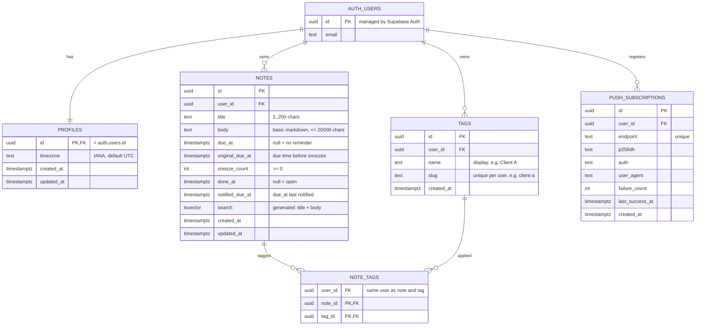

# Database schema

Source of truth: `supabase/migrations/` (applied to the Supabase project
`onti-notes-reminders`). This document explains it.
Decisions: `docs/adr/ADR-003-data-model-and-time.md`.

## Diagram

## Tables

### `profiles`
One row per auth user, created by the `on_auth_user_created` trigger.
`timezone` is reported by the browser on first login and validated by the
API against the IANA database.

### `notes`
A note and its optional reminder (ADR-003).

| Column | Meaning |
|--------|---------|
| `due_at` | When the reminder is due (UTC). `null` → plain note, and then all reminder columns must be empty (`notes_reminder_fields_consistent`). |
| `original_due_at` | `due_at` before any snooze. Set on create and on manual reschedule only. |
| `snooze_count` | Number of snoozes since the last manual schedule. |
| `done_at` | When it was marked done; `null` = open. Undo sets it back to `null`. |
| `notified_due_at` | The `due_at` value a notification was sent for. The scheduler picks a note when `due_at <= now`, `done_at is null` and `notified_due_at is distinct from due_at`. |
| `search` | Generated `tsvector` (`simple`) over title + body. |

Indexes: open reminders per user by due time (Today page), open reminders
by due time (scheduler), notes per user by creation (All notes), GIN on
`search`.

### `tags` and `note_tags`
Tags are per user: `name` is shown ("Client A"), `slug` is typed in
`#client-a` filters and is unique per user. `note_tags.user_id` plus the
composite foreign keys guarantee note and tag belong to the same user.

### `push_subscriptions`
One row per browser/device that accepted notifications. `failure_count`
lets the scheduler drop endpoints that keep failing (e.g. 410 Gone).

## Security

- RLS is enabled on every table; each policy is `user_id = auth.uid()`
  (`id = auth.uid()` for profiles).
- `anon` has no privileges. `authenticated` has CRUD, filtered by RLS.
- The API runs user requests as `authenticated` with the verified JWT
  claims (ADR-001), so RLS applies to the API path too.
- Trigger functions (`handle_new_user`, `set_updated_at`) are not
  executable by any client role (migration `20261007090000`). The Supabase
  security advisor reports 0 findings on the deployed database.

## Verified

The migration was applied to a local PostgreSQL 16 with stand-ins for the
Supabase `auth` schema and loaded with the scenario dataset. Results:
every count in `docs/CONTRACT.md` matches; another user sees 0 notes and
updates 0 rows; a spoofed insert is rejected; inconsistent reminder fields,
cross-user tags and invalid slugs are rejected by constraints.
